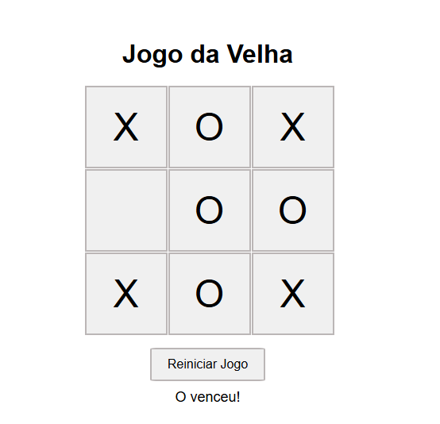

# Jogo da Velha

Este é um simples **Jogo da Velha** desenvolvido com HTML, CSS e JavaScript. Foi criado para relembrar os velhos tempos de escola, quando jogávamos esse jogo clássico com os colegas, desenhando o tabuleiro em uma folha de papel ou na lousa da sala de aula.

## Como Jogar

- O jogo é para dois jogadores: "X" e "O".
- Cada jogador faz sua jogada alternadamente, clicando em uma das células do tabuleiro.
- O objetivo é conseguir uma linha, coluna ou diagonal com três símbolos iguais (X ou O).
- Quando um jogador vence, uma mensagem será exibida.
- Se todas as células forem preenchidas e ninguém vencer, o jogo termina em empate.
- Você pode reiniciar o jogo a qualquer momento clicando no botão "Reiniciar Jogo".

## Tecnologias Utilizadas

- **HTML5**: Para a estrutura da página.
- **CSS3**: Para o estilo e layout do jogo.
- **JavaScript**: Para a lógica do jogo, alternância de jogadores e verificação de vitória ou empate.

## Nostalgia

Este jogo foi feito com o propósito de relembrar os momentos divertidos da infância, quando jogávamos o bom e velho jogo da velha na escola, seja em folhas de papel, no caderno ou até mesmo desenhando o tabuleiro na lousa. Um jogo simples, mas que traz muitas memórias boas.

## Como Executar

1. Baixe ou clone o repositório.
2. Abra o arquivo `index.html` em qualquer navegador de sua preferência.
3. Aproveite e divirta-se!

## Captura de Tela

## Licença

Este projeto é de uso livre, sinta-se à vontade para modificar e compartilhar.

---

Feito com carinho para relembrar os bons momentos dos tempos de escola.
